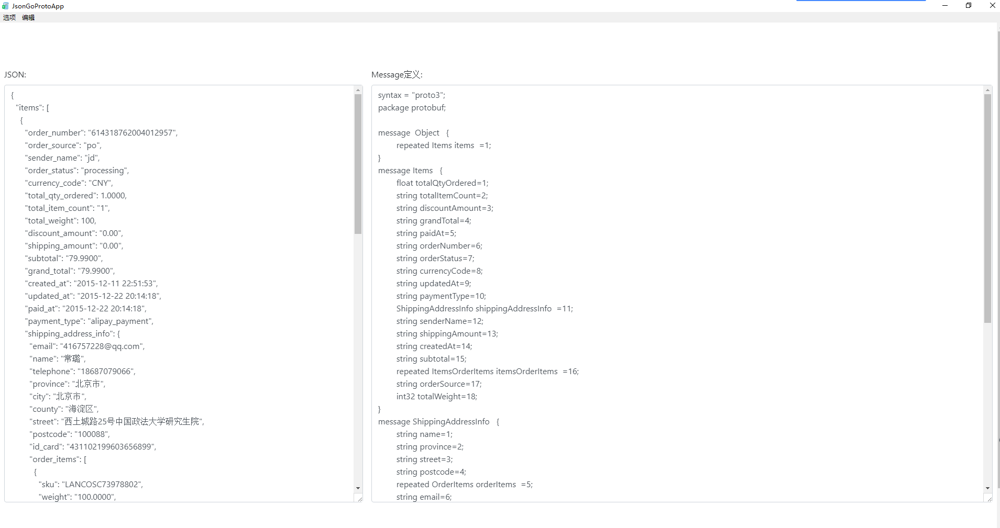

# 介绍
这个工程只是做一个GUI图形界面app，拷贝json到最左边的文本框点击一下别处就可以得到struct了 <br>
实际的json解析转换实现是在我的另一个工程里 https://github.com/GrayOxygen/json-go-struct
## 为什么用?
1. 不只是嵌套struct,还有分离的多个struct<br>

2. 相同的struct名字<br>
    从树形结构自上往下, 用父节点名字+当前名字作为新的名字，另一个重复的就保持名字不变

## Download App
直接下载app https://github.com/GrayOxygen/json-go-struct-app/releases just unzip release file to get app

>用mac的话，直接解压后双击就行，不必放在Applications下

</br> 如果你要做一些定制化的东西，记得按照如下步骤进行打包生成app（下面就不翻译了，你可以看懂）


# Step 1: install the app

Run the following commands:

    $ go get -u github.com/GrayOxygen/json-go-struct-app/...
    $ rm $GOPATH/src/github.com/GrayOxygen/json-go-struct-app/bind.go

# Step 2: install the bundler

Run the following command:

    $ go get -u github.com/asticode/go-astilectron-bundler/...
    
And don't forget to add `$GOPATH/bin` to your `$PATH`.
    
# Step 3: bundle the app for your current environment

Run the following commands:

    $ cd $GOPATH/src/github.com/GrayOxygen/json-go-struct-app
    $ astilectron-bundler -v
    
# Step 4: use the app

The result is in the `output/<your os>-<your arch>` folder and is waiting for you to use it!

# Step 5: bundle the app for more environments

To bundle the app for more environments, add an `environments` key to the bundler configuration (`bundler.json`):

```json
"environments": [
  {"arch": "amd64", "os": "linux"},
  {"arch": "amd64", "os": "windows"},
  {"arch": "386", "os": "windows"},
  {"arch": "amd64", "os": "darwin"},
]
```

and repeat **step 3**.
