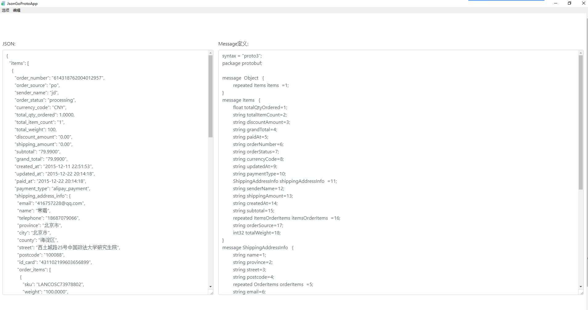
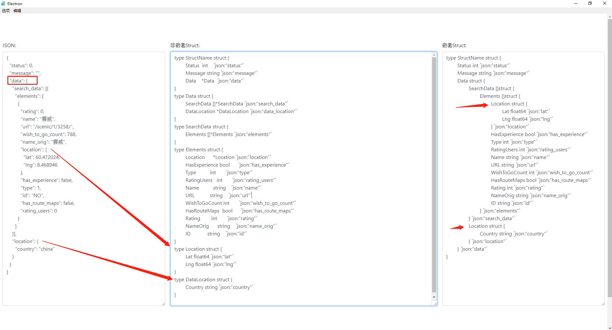

# Introduction
this project just made a GUI app, copy json to left textarea , you will get struct info <br>
by the way , the parse json part is in my another project https://github.com/GrayOxygen/json-go-struct
## Why Use Me?
1. not only nest struct , also multi separate struct<br>

2. same struct name rule<br>
    from top to bottom , use father node name + current name as a new name

## Download App
you can download app  https://github.com/GrayOxygen/json-go-struct-app/releases just unzip release file to get app

>(exe or mac app, if you use mac app , you just unzip file to anywhere,double click JsonGoStructApp,can be work,I mean there is no mac app in Applications for you,cuz I generated mac app,but not work be a app in Applications),

</br> or you can also install manually follow below 5 steps to get app if you want change my code for your purpose .


# Step 1: install the app

Run the following commands:

    $ go get -u github.com/GrayOxygen/json-go-struct-app/...
    $ rm $GOPATH/src/github.com/GrayOxygen/json-go-struct-app/bind.go

# Step 2: install the bundler

Run the following command:

    $ go get -u github.com/asticode/go-astilectron-bundler/...
    
And don't forget to add `$GOPATH/bin` to your `$PATH`.
    
# Step 3: bundle the app for your current environment

Run the following commands:

    $ cd $GOPATH/src/github.com/GrayOxygen/json-go-struct-app
    $ astilectron-bundler -v
    
# Step 4: use the app

The result is in the `output/<your os>-<your arch>` folder and is waiting for you to use it!

# Step 5: bundle the app for more environments

To bundle the app for more environments, add an `environments` key to the bundler configuration (`bundler.json`):

```json
"environments": [
  {"arch": "amd64", "os": "linux"},
  {"arch": "amd64", "os": "windows"},
  {"arch": "386", "os": "windows"},
  {"arch": "amd64", "os": "darwin"},
]
```

and repeat **step 3**.
